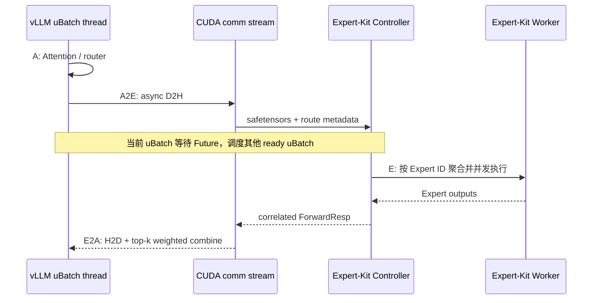
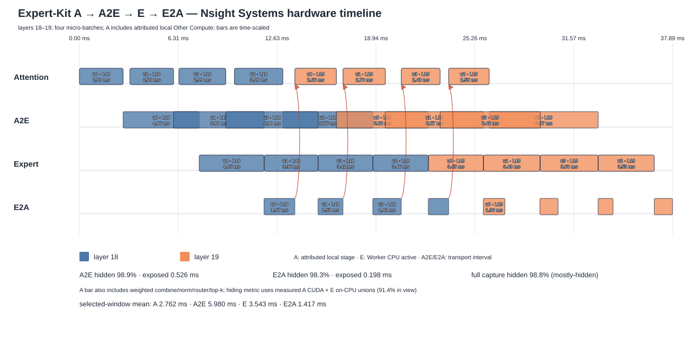
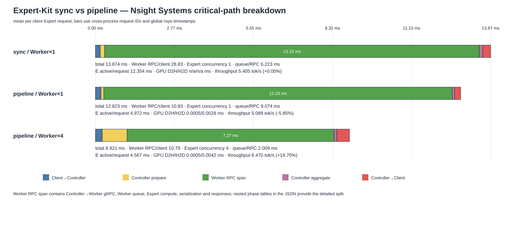

# Expert-Kit / vLLM 四阶段流水设计与验证

> 逐文件代码 Review 导航、脚本参数和从零复现实验命令见
> [`ae-dbo-code-review-and-reproduction.md`](ae-dbo-code-review-and-reproduction.md)。

## 1. 总结

本实现把 vLLM 的一个 uniform-decode batch 拆成四个 micro-batch，并将每个 MoE 层划分为四个可观测阶段：

```text
A（Attention/本地非 Expert 计算）
  -> A2E（D2H、序列化和 Dispatch）
  -> E（Controller/Worker 远程 Expert）
  -> E2A（返回、H2D、top-k Combine）
```

uBatch 等待远程 Expert Future 时，会释放 Python 模型执行权；其他已就绪 uBatch 可以继续推进，从而让一个 uBatch 的 A 与另一个 uBatch 的 E 重叠。当前验证结论必须分层理解：

| 验证项 | 状态 | 证据 |
|---|---|---|
| 四阶段调度与重叠 | **PASS** | 真实 trace 中四个 uBatch、35,454 个完整调用、A/E 和 E/E 重叠 |
| nsys 硬件计算/通信重叠 | **PASS** | layers 18–19 的通信被完整 capture 中其他 uBatch 计算掩盖 98.8%，暴露 0.724ms |
| Expert RPC 并发数值等价 | **PASS** | 真实 Controller/CPU Worker；串行与四路并发 BF16 输出逐元素相等 |
| 模型级严格 token 等价 | **FAIL** | pipeline 与同步参考存在 token 分歧；同步模式跨轮自身也非 bitwise deterministic |
| 当前环境性能提升 | **CONDITIONAL PASS** | Worker×1 吞吐 -5.85%；Worker×4 吞吐 **+19.70%**、延迟 -16.46% |

因此，当前代码证明了流水机制确实工作，并在 CPU Worker 有四个执行槽时取得可重复吞吐收益；但模型级严格 token 等价仍未通过，不能把性能 PASS 当作完整正确性 PASS。单线程 Worker 无法消费流水并发，拆 micro-batch 后的 RPC 和排队开销仍会导致负收益。完整同步/流水 profile、通信拆分和瓶颈分析见 [`ae-dbo-profile-comparison.md`](ae-dbo-profile-comparison.md)。

> 并发控制勘误：历史报告沿用 `Worker×1/Worker×4` 标签，但当前 gRPC
> Worker 不读取 `EK_WORKER_THREADS`；数字 1/4 是对应报告中实际观测到的最大
> Expert 并发，并非该参数锁定的实验变量。因此 `+19.70%` 是有效的历史观测，
> 但不能仅归因于 `--worker-threads 4`。严格复现边界见
> [`ae-dbo-code-review-and-reproduction.md`](ae-dbo-code-review-and-reproduction.md)。

## 2. 架构与数据流



真实 trace 的时间比例图如下。该图不是人工示意：由 `EK_PIPELINE_TRACE` 生成的 Chrome trace 自动选取 layer 1 的相邻四 uBatch 窗口，窗口长度约 23.234ms。


图中可同时观察到：

- uBatch 1/3 的 E 与 uBatch 0/2 的 A 重叠；
- 多个 uBatch 的远程 E Future 同时处于 in-flight 状态；
- 每个调用内部仍保持 A → A2E → E → E2A 顺序。

上图使用 Python `perf_counter_ns()`，适合验证调度顺序，但 A/E 是客户端逻辑墙钟区间：重叠的 E 表示多个客户端正在等待远程 Expert，并不证明 Worker CPU 同时计算。E2A 也主要反映异步 H2D 提交开销，不能作为硬件阶段耗时。下面的新图来自同一次 Nsight Systems 2026.1 采集，纵向按四阶段排列，并选择稳定 decode 的相邻 layers 18–19：



nsys 图采用“阶段归属显示 + 硬件掩盖统计”两层口径：

- 图中的 A 从上一层 E2A 完成画到本层 dispatch 开始，把本地 weighted combine、RMSNorm、Attention、Router、softmax/top-k 和路由准备统一归入 Accelerator/Attention 阶段；这是阶段墙钟跨度；
- 掩盖量中的 A 仍只使用 `Qwen3MoeAttention` NVTX 投影出的 CUDA kernel 并集，避免把无法单独归属的等待时间当成 GPU 活跃；
- E 是 Worker `exp.forward()` NVTX 与 OS context-switch 数据相交后的 on-CPU 时间并集；本次 `EK_WORKER_PARALLEL=1` 且 `EK_WORKER_THREADS` 使用默认值 1，实际 Expert 最大并发为 1；
- A2E 从 dispatch NVTX 开始到 Worker 第一个 Expert 计算开始，包括 D2H、序列化、两段 gRPC 和 Controller 分发，不再包含 Router/top-k；
- E2A 从本请求最后一个 Expert 计算结束到关联 H2D memcpy 在 GPU 上实际完成，包括 Worker/Controller 返回、聚合、反序列化和传输；
- Router 和 weighted combine 等本地计算显示为 A，但在缺少独立 NVTX kernel 归属前不加入硬件掩盖量。

对每个 A2E/E2A 区间，`hidden` 定义为它与其他 uBatch 的 A/E 硬件活动时间并集的交集；同一请求自己的计算不计入掩盖。八个调用的结果为：

| 阶段 | 平均硬件/阶段时间 | 范围 | 通信总量 | 被其他 uBatch 计算掩盖 | 暴露时间 |
|---|---:|---:|---:|---:|---:|
| A（归属阶段跨度） | 2.762ms | 2.481–3.094ms | — | — | — |
| A2E | 5.980ms | 4.863–6.967ms | 47.841ms | **98.9%** | 0.526ms |
| E | 3.543ms | 3.356–4.051ms | — | — | — |
| E2A | 1.417ms | 0.956–1.967ms | 11.334ms | **98.3%** | 0.198ms |
| A2E + E2A | — | — | 59.175ms | **98.8%** | **0.724ms** |

按不低于 95% 才算“基本完全掩盖”的标准，当前结论是 **PASS / 基本完全掩盖**。上述主指标允许完整 profile window 内、图外相邻层的其他 uBatch 计算覆盖图中 layers 18–19 的通信，这是持续流水的真实稳态口径；八次 A2E 均为 98.6%–99.2%，八次 E2A 为 95.5%–99.6%。如果故意只允许图中两个 layer 的 A/E 参与覆盖，结果为 91.1%，它是有限画布造成的保守下界。两层图仍能看到启动/排空气泡，但不能把图外 layer 17/20 的真实计算从流水收益中删除。

### 2.1 其他层是否接近

完整 capture 覆盖模型全部 48 层。排除 prefill/uBatch 0 单路调用后，从完整四 uBatch decode 窗口得到 736 个调用：

- 各层 A 中位数为 1.78–2.05ms，整体中位数 1.90ms，计算时间高度接近；
- 各层 E 中位数为 3.46–4.07ms，整体中位数 3.65ms，同样较稳定；
- 各层 A2E 中位数为 4.05–10.49ms，多数层为 4.4–7.5ms；
- 各层 E2A 中位数为 0.79–3.37ms，整体中位数 1.47ms。

因此 layers 18–19 对 Attention/Expert 硬件计算具有代表性；A2E/E2A 的层间差异更大，因为它们包含 Python executor、Controller/Worker 排队、不同 Expert 路由、序列化和 gRPC 调度，不能解释为模型层本身算力不同。图中 A 的 2.762ms 是扩大归属后的阶段跨度；其中原始 Attention CUDA kernel 并集平均仍为 2.098ms，E 的硬件活跃平均为 3.543ms。

## 3. Expert-Kit 项目修改

### 3.1 协议与 Python 生成代码

`ek-proto/ek/worker/v1/expert.proto` 在原有张量字段之后追加兼容的 proto3 字段：

| 消息 | 字段 | 用途 |
|---|---|---|
| `ForwardReq` | `request_id` | 唯一关联一次远程 Expert 调用 |
| `ForwardReq` | `microbatch_id` | 标识 uBatch 0–3 |
| `ForwardReq` | `layer_id` | 标识当前 MoE layer |
| `ForwardReq` | `pipeline_enabled` | Controller 是否启用 request-local 并发路径 |
| `ForwardResp` | `request_id/microbatch_id/layer_id` | 客户端校验响应未串线 |

这些字段有 proto3 默认值，旧同步客户端仍可发送不包含新字段的请求。

`expertkit_vllm` 和 `expertkit_torch` 都发布同一份 proto 的 Python 生成代码，因此两边的 `expert_pb2.py/.pyi/_grpc.py` 都必须同步。Torch 目录没有加入任何 vLLM 或流水业务逻辑；其普通客户端仍调用阻塞 `Forward`。

重新生成时还出现 `StateService` 从旧的 `Retrieve/Update` 更新为当前 proto 的双向流 `Exchange`。这是 Torch/vLLM 生成文件此前落后于共享 proto 的历史漂移，不是本次流水设计出的接口。完整生成同步可以避免同一进程加载两个不同版本的 `ek/worker/v1/expert.proto` descriptor。

### 3.2 Controller

旧路径通过一个全局 `Mutex<Executor>` 串行处理请求。流水请求改为每个 `ForwardReq` 创建独立 `NaiveExecutor::new_pipeline()`：

- 不持有全局 executor mutex 等待远程 Worker；
- 在请求本地保存 request/uBatch/layer 元数据；
- Controller 到 Worker 的请求和最终响应都回传关联字段；
- Expert 不存在时立即失败，不再跳过后生成不完整结果；
- pipeline 模式当前只接受 gRPC Worker channel，SHM/RDMA 返回明确错误。

未设置 `pipeline_enabled` 的旧请求继续走原全局 executor 路径，兼容现有 Torch 集成。

### 3.3 Worker

Worker 的 Expert 数学计算本身不改变。它在日志中记录流水元数据，并在 `ForwardResp` 原样回传关联字段。这样客户端能在反序完成的并发 RPC 中检测响应串线，而不依赖完成顺序。

为区分 RPC 等待和 CPU 硬件计算，`EK_NSYS_PROFILE=1` 时 Worker 会在最内层 `exp.forward()` 外打 NVTX range，标签包含 request/uBatch/layer/expert。NVTX3 通过一个 C shim 接入；构建时从 `CUDA_HOME/include` 查找 header，找不到时编译为 no-op。普通运行不设置该环境变量，不产生 range 字符串和 NVTX 调用。

## 4. vLLM 插件修改

### 4.1 异步 Expert 客户端

`ExpertKitClient.submit_forward_expert()` 返回两个 Future：

- `a2e_future`：CUDA D2H 完成并已序列化，可认为 Dispatch 已准备完成；
- `future`：远程 Expert RPC 和响应反序列化完成。

CUDA hidden states 先异步复制到 pinned host memory，并用 CUDA Event 防止后台线程在 D2H 完成前读取；返回张量使用 pinned memory，使 E2A 可以进行 non-blocking H2D。四线程 executor 对应最多四个并发 uBatch RPC。

收到响应后严格比较 `request_id`、`microbatch_id` 和 `layer_id`。任一不匹配均抛出错误，不把错误张量交给模型。

### 4.2 `GrpcExpert.forward()` 四阶段切换

pipeline 关闭时继续调用阻塞 `forward_expert()`。开启后：

1. 记录从上一个 E2A 结束到本层 dispatch 前的 A 区间；
2. 从 compute stream 切到 comm stream，提交 D2H/异步 RPC；
3. 调用 `dbo_wait_for_future()`，当前 uBatch 阻塞时让其他 ready uBatch 运行；
4. RPC 完成后执行 pinned-memory H2D，并通过 stream event 保证 combine 看到完整数据；
5. 记录 A/A2E/E/E2A Chrome trace 和 NVTX range。

原代码中通过将 hidden state 四舍五入来推测“重复 token”的优化会改变输入语义并增加同步点，因此已移除。

### 4.3 配置、版本与回退

- `EK_PIPELINE_ENABLE=1`：启用四阶段路径；
- `EK_PIPELINE_TRACE=/path/trace.json`：记录 Chrome trace；
- plugin 固定要求 vLLM `0.25.1` 和对应补丁；
- 仅 uniform decode、至少四请求且 `ubatch_size=4` 时切成四 uBatch；
- prefill、mixed prefill/decode、少于四请求自动走非 uBatch 路径；
- 当前要求 `enforce_eager=True`，不承诺 CUDA Graph 兼容。

## 5. vLLM 0.25.1 源码补丁

vLLM 安装在 `.venv/site-packages`，不属于当前 Git worktree。所有修改以统一补丁追踪：

```text
ek-integration/expertkit_vllm/patches/
  vllm-0.25.1-expertkit-pipeline.patch
```

补丁修改五个文件：

| vLLM 文件 | 修改 |
|---|---|
| `vllm/v1/worker/ubatching.py` | 用 completion-driven ready queue 替代固定 ring；增加 Future wait、失败广播和 context 恢复 |
| `vllm/v1/worker/gpu_ubatch_wrapper.py` | 收集并传播子线程异常；允许 single-DP uBatch metadata |
| `vllm/v1/worker/gpu_model_runner.py` | single-DP 下对 uniform decode 开启 uBatch，并拒绝空切片 |
| `vllm/config/vllm.py` | 外部 Expert pipeline 下不强制 DeepEP/NIXL All-to-All backend |
| `vllm/model_executor/models/qwen3_moe.py` | profile 模式下为完整 Attention launch 范围增加 layer/uBatch NVTX |

### 5.1 查看统一 diff

```bash
less ek-integration/expertkit_vllm/patches/vllm-0.25.1-expertkit-pipeline.patch

git apply --stat \
  ek-integration/expertkit_vllm/patches/vllm-0.25.1-expertkit-pipeline.patch
```

补丁中 `-` 是原始 vLLM 代码，`+` 是 Expert-Kit 修改。

### 5.2 查看当前安装源码

```bash
VLLM_PACKAGE_ROOT=$(
  .venv/bin/python -c \
  'import pathlib, vllm; print(pathlib.Path(vllm.__file__).parent)'
)

rg -n \
  'UBatchCoordinator|dbo_wait_for_future|Expert-Kit can overlap|external_expert_pipeline' \
  "$VLLM_PACKAGE_ROOT"
```

### 5.3 验证补丁状态

```bash
.venv/bin/python \
  ek-integration/expertkit_vllm/scripts/apply_vllm_pipeline_patch.py --check
```

脚本要求 vLLM 版本严格为 0.25.1，并对四个 pristine/patched 文件分别校验 SHA256；部分应用或未知本地修改会直接报错。

只检查当前补丁能否反向恢复而不修改环境：

```bash
VLLM_SITE_ROOT=$(dirname "$VLLM_PACKAGE_ROOT")
patch --dry-run --reverse -p1 \
  -d "$VLLM_SITE_ROOT" \
  -i "$PWD/ek-integration/expertkit_vllm/patches/vllm-0.25.1-expertkit-pipeline.patch"
```

## 6. 正确性验证

### 6.1 单元测试

```bash
.venv/bin/python -m pytest \
  ek-integration/expertkit_vllm/tests/test_pipeline.py -q
```

无服务环境结果为 `7 passed, 1 skipped`，覆盖：

- tensor/metadata 异步传递；
- response correlation 不匹配拒绝；
- Future 按实际完成顺序恢复；
- sibling uBatch 异常广播；
- 四阶段 trace 结构与重叠；
- SVG 渲染。

### 6.2 真实 Expert RPC 等价

三个服务就绪后运行：

```bash
EK_PIPELINE_LIVE_TEST=1 \
EK_MODEL_NAME=qwen3-30b-a3b \
EK_ADDR=localhost:5002 \
EK_CLIENT_TIMEOUT=120 \
.venv/bin/python -m pytest \
  ek-integration/expertkit_vllm/tests/test_pipeline.py -q
```

测试从 Qwen `config.json` 读取 hidden size，构造 batch size 为 1/2/3/4 的固定 BF16 输入，先串行调用，再四路并发调用相同 Experts。实测 `8 passed`，每组输出 shape/dtype 一致且 `torch.equal()` 为真。

### 6.3 模型 token 等价

正式 benchmark 保存同步和流水每轮、每个 prompt 的 token IDs。结果不是严格等价：五轮流水均至少有一个 prompt 与同步参考分歧，`The key idea behind a pipeline is` 多次从第 1 个生成 token 后开始退化。

同时，同步模式自身跨轮也出现首分歧（例如 token 1、3、15），说明当前完整服务链并非 bitwise deterministic。因此 token 差异不能全部归因于流水，但流水的重复退化仍是未解决的模型级正确性问题。当前状态标记为 **FAIL**，不能仅凭部分自然语言输出正常而标记 PASS。

### 6.4 Trace 验证和绘图

```bash
EK_PIPELINE_ENABLE=1 \
EK_PIPELINE_TRACE=/tmp/expertkit-pipeline-trace.json \
timeout 900s .venv/bin/python \
  ek-integration/expertkit_vllm/benchmark/pipeline_benchmark.py \
  --child-mode pipeline \
  --child-output /tmp/expertkit-pipeline-result.json \
  --trace /tmp/expertkit-pipeline-trace.json \
  --warmup 0 \
  --repetitions 1

.venv/bin/python \
  ek-integration/expertkit_vllm/scripts/validate_pipeline_trace.py \
  /tmp/expertkit-pipeline-trace.json

.venv/bin/python \
  ek-integration/expertkit_vllm/scripts/render_pipeline_trace.py \
  /tmp/expertkit-pipeline-trace.json \
  doc/assets/ae-dbo-four-stage-overlap.svg
```

EngineCore 由 signal 退出时不保证执行 Python `atexit`，因此 tracer 每 4096 个事件原子写一个快照。validator 允许快照尾部仍在执行的少量不完整调用，但任何远离 trace 尾部的缺失阶段仍判定失败。本次 trace 有 35,454 个完整调用和 4 个快照尾部调用。

### 6.5 Nsight Systems 硬件 Profile

先完成 release 构建并确认 6543、5001、5002、51234 未被占用。统一启动器会依次启动 weight-server、Controller、Worker，warmup 一次后运行一轮四 prompt × 4 tokens 的流水 workload，最后只停止它自己启动的三个服务：

```bash
cargo build --release --bin ek-cli

nsys profile \
  --trace=cuda,nvtx,osrt \
  --trace-fork-before-exec=true \
  --sample=none \
  --cpuctxsw=process-tree \
  --cuda-event-trace=true \
  --resolve-symbols=false \
  --wait=primary \
  --force-overwrite=true \
  --output=/tmp/expertkit-four-stage \
  .venv/bin/python \
  ek-integration/expertkit_vllm/scripts/run_nsys_pipeline_profile.py \
  --config dev/hello-world.config.yaml \
  --model qwen3-30b-a3b \
  --log-dir /tmp/ek-nsys-logs \
  --max-tokens 4 \
  --benchmark-output /tmp/ek-nsys-workload.json
```

`--trace-fork-before-exec=true` 是必需项：vLLM EngineCore 由 multiprocessing forkserver 创建，默认 nsys process-tree 能看到 CUDA activity，但看不到子进程里的 Python NVTX。启动器还设置 `VLLM_NO_USAGE_STATS=1`，避免 nsys 2026.1 把退出阶段 `py-cpuinfo` 的短 `file` 子进程留成 zombie；该设置不改变推理计算。

本机 nsys 的 deferred `--capture-range=nvtx` 同样会挂住 `py-cpuinfo` 的 pipe 子进程，因此复现命令从启动时采集，在分析阶段只保留 `EK_PROFILE_WINDOW` 内的事件。模型加载和 warmup 存在于原始 `.nsys-rep`，但不会进入结果统计。

导出、统计和绘图：

```bash
.venv/bin/python \
  ek-integration/expertkit_vllm/scripts/analyze_nsys_pipeline.py \
  /tmp/expertkit-four-stage.nsys-rep \
  /tmp/expertkit-four-stage-analysis.json

.venv/bin/python \
  ek-integration/expertkit_vllm/scripts/render_nsys_pipeline.py \
  /tmp/expertkit-four-stage-analysis.json \
  doc/assets/ae-dbo-nsys-four-stage-overlap.svg
```

实际环境：nsys 2026.1.3、RTX 5090、驱动 610.43.03、Torch 2.11.0+cu130、CUDA 13.0、vLLM 0.25.1、CPU Worker。原始报告约 19MB、导出 SQLite 约 85MB，均保存在 `/tmp`，不提交仓库。profile 本身有观测开销，本轮 16 tokens 用时 5.033s；该吞吐不替代关闭 profile 的正式性能基准。

可直接用 Nsight Systems GUI 查看原始报告：

```bash
nsys-ui /tmp/expertkit-four-stage.nsys-rep
```

在 GUI 中先定位最外层 `EK_PROFILE_WINDOW`，然后展开 EngineCore 的 CUDA HW 行查看 kernels 和 HtoD/DtoH memcpy，展开 Worker 进程的 CPU thread/NVTX 行查看 `EK:E:req=...:u=...:l=...`。搜索 `EK:A:`、`EK:A2E:`、`EK:E:`、`EK:E2A:` 可以按阶段过滤；点击 NVTX range 或 CUDA activity 可查看 start、duration、stream、correlation ID 和调用线程。远程服务器没有桌面时，可把约 19MB 的 `.nsys-rep` 复制到安装了相同或更高版本 Nsight Systems 的本地电脑打开，查看报告不需要本地 GPU。

命令行也可以查看：

```bash
nsys stats --report nvtx_pushpop_trace \
  /tmp/expertkit-four-stage.nsys-rep
nsys stats --report nvtx_gpu_proj_trace \
  /tmp/expertkit-four-stage.nsys-rep
nsys stats --report cuda_gpu_trace:nvtx-name \
  /tmp/expertkit-four-stage.nsys-rep
```

`.sqlite` 适合脚本或 DB Browser for SQLite 查询，但跨 NVTX、CUDA runtime correlation 和 Worker context-switch 的关联较复杂，日常查看优先使用 `nsys-ui`，定量复现优先使用本项目分析器。

### 6.6 同步、单线程流水与四线程流水对比

已补充不开流水线的同步详细 NVTX/Controller/Worker profile，并与 pipeline/Worker×1、pipeline/Worker×4 做跨进程 request-ID 关联。统一分析器和对比图为：

```bash
.venv/bin/python \
  ek-integration/expertkit_vllm/scripts/analyze_nsys_comparison.py \
  --sync /tmp/expertkit-sync-detailed.nsys-rep \
  --pipeline-serial /tmp/expertkit-pipeline-serial-detailed.nsys-rep \
  --pipeline-parallel /tmp/expertkit-pipeline-parallel-detailed.nsys-rep \
  --output /tmp/expertkit-nsys-comparison.json

.venv/bin/python \
  ek-integration/expertkit_vllm/scripts/render_nsys_comparison.py \
  /tmp/expertkit-nsys-comparison.json \
  doc/assets/ae-dbo-sync-vs-pipeline-profile.svg
```



结论是 gRPC channel 初始化仅发生一次且约 2.3–2.6ms，pipeline 的真实 D2H/H2D memcpy 为微秒级；主要等待位于 Worker queue。完整数字、CUPTI 同步采集缺口说明、正式吞吐和复现命令见 [`ae-dbo-profile-comparison.md`](ae-dbo-profile-comparison.md)。

## 7. 性能基准

性能运行必须关闭 trace 和 Nsight。三种模式均由统一启动器独立启动服务，完成一次 warmup 后运行五轮：

```bash
.venv/bin/python \
  ek-integration/expertkit_vllm/scripts/run_nsys_pipeline_profile.py \
  --config dev/hello-world.config.yaml \
  --model qwen3-30b-a3b \
  --mode sync --worker-threads 1 \
  --no-profile-window \
  --warmup 1 --repetitions 5 --max-tokens 32 \
  --benchmark-output /tmp/expertkit-benchmark-sync.json
```

另外两轮分别使用 `--mode pipeline --worker-threads 1` 和 `--mode pipeline --worker-threads 4`。条件：RTX 5090、vLLM 0.25.1、Torch 2.11.0/CUDA 13.0、CPU Expert Worker、四条固定 prompt、每条 32 tokens、temperature 0、eager；只计 `generate()`。

| 模式 | 五轮延迟范围（秒） | 中位延迟（秒） | 中位吞吐（tokens/s） | p95 吞吐 |
|---|---:|---:|---:|---:|
| 同步 / Worker×1 | 23.020–23.932 | 23.681 | 5.405 | 5.546 |
| 四阶段流水 / Worker×1 | 24.955–25.378 | 25.152 | 5.089 | 5.121 |
| 四阶段流水 / Worker×4 | 19.472–19.963 | 19.784 | 6.470 | 6.571 |

相对同步：

- pipeline/Worker×1：中位吞吐 **-5.85%**，中位延迟 **+6.21%**；
- pipeline/Worker×4：中位吞吐 **+19.70%**，中位延迟 **-16.46%**。

nsys 显示单线程流水虽然存在 A/E 重叠，但 Worker Expert 最大并发仍为 1，单 RPC 排队从同步的 6.223ms 增至 9.074ms；拆分请求的新增开销超过被隐藏时间。Worker×4 把最大并发提高到 4、排队降至 2.009ms，因而取得正收益。与此同时，单个 CPU Expert 数学计算从 0.452ms 增至 0.933ms，暴露出线程/内存带宽争用。详细分析见 [`ae-dbo-profile-comparison.md`](ae-dbo-profile-comparison.md)。

带 trace 的五轮曾测得 -51.10% 吞吐变化且延迟逐轮增长，确认是周期性全量 trace 快照的观测开销；该数据不作为性能结论。

## 8. 完整复现

```bash
source .venv/bin/activate
export QWEN3_30B_A3B_ROOT="$(realpath ./qwen3-30b-a3b)"
export EK_CONFIG="$(realpath ./dev/hello-world.config.yaml)"

uv pip install vllm==0.25.1
uv pip install --no-deps -e ek-integration/expertkit_vllm
python ek-integration/expertkit_vllm/scripts/apply_vllm_pipeline_patch.py --apply
python ek-integration/expertkit_vllm/scripts/apply_vllm_pipeline_patch.py --check

target/release/ek-cli --config "$EK_CONFIG" model upsert --name qwen3-30b-a3b
target/release/ek-cli --config "$EK_CONFIG" weight-server --model "$QWEN3_30B_A3B_ROOT"
target/release/ek-cli --config "$EK_CONFIG" schedule static --inventory dev/local.inventory.yaml
target/release/ek-cli --config "$EK_CONFIG" controller
target/release/ek-cli --config "$EK_CONFIG" worker
```

三个服务分别以前台进程运行。停止时按 Worker → Controller → weight-server 顺序发送 Ctrl-C。

## 9. 当前限制与下一步

- 模型级 token 严格等价未通过，需要定位 uBatch attention/KV metadata、共享 CUDA stream 和结果拼接顺序；
- 当前只有 gRPC Worker pipeline；
- prefill/mixed batch 尚未流水；
- CPU Worker×1 为负收益；Worker×4 已有正收益，但线程争用和 p95 排队长尾仍需优化；
- trace 是诊断模式，不能在正式性能基准中开启；
- 下一阶段应先建立 layer-level hidden/logits 对照，找出首个产生数值差异的 layer，再讨论扩大适用范围或宣称吞吐收益。
