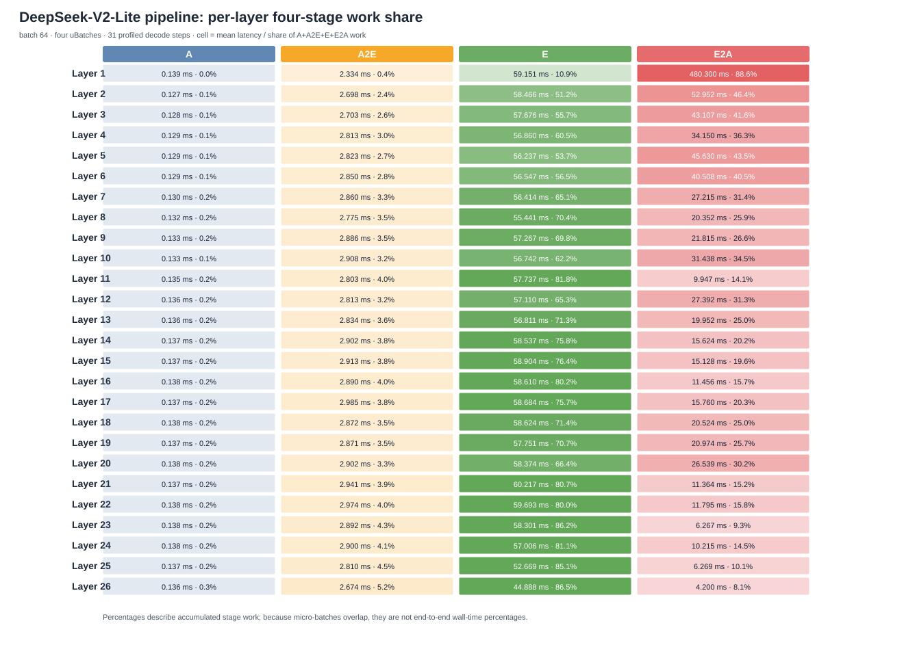
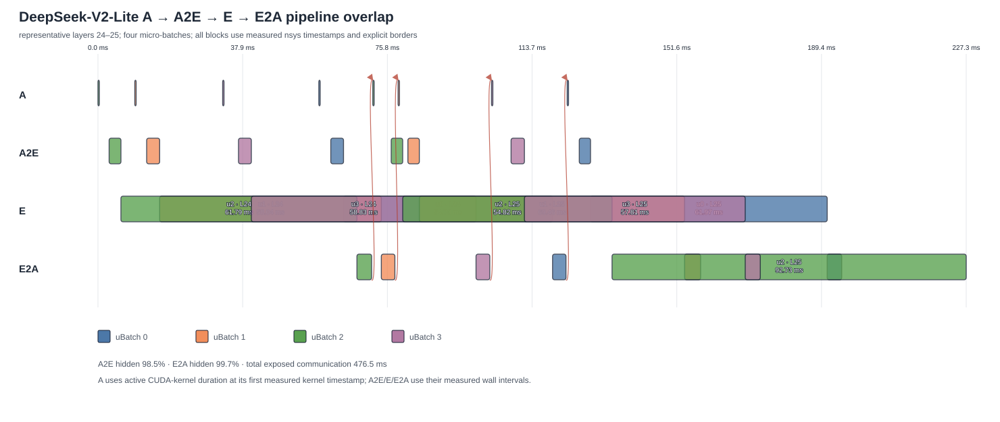

# DeepSeek-V2-Lite 四阶段流水测试结果

## 1. 总结

测试日期：2026-07-22。当前状态：**FAIL**。

- 已确认 pipeline decode 真正切成 4 个 uBatch，每个 16 tokens；32 个输出 token 中首个 token 来自 prefill，详细统计覆盖后续 31 个 decode step。
- sync 与 pipeline 使用同一 vLLM legacy GPU model runner。之前的 batch 4–64 结果实际被 vLLM 自动切到 V2 Model Runner，绕过了 four-stage patch，因而作废，不能用于判断流水性能。
- batch 64 的 output throughput 从 56.589 降至 27.078 token/s，pipeline 只有 sync 的 47.85%。
- pipeline 将每层每 step 的一次 Expert RPC 拆成四次；decode 调用数从 806 增至 3224。较小的 micro-batch 仍会覆盖大量相同专家，导致小 GEMM、重复专家调用和 CPU 并发争用。
- 单次 E 均值从 27.947 ms 增至 57.104 ms；E2A P95 从 2.149 ms 增至 117.156 ms。后者主要是 CPU 饱和时响应处理被延迟，不是 gRPC 建连。
- A2E/E2A 的累计等待有 99.65% 与其它调用的 A/E 重叠；通信确实被隐藏，但新增的 Expert 工作和 CPU 争用远大于被隐藏的通信，因此总吞吐下降。
- 严格 token 等价失败：首个差异在 ShareGPT 请求 `oyditDt` 的第 6 个输出 token，sync 为 207，pipeline 为 1。性能数据可用于定位瓶颈，但不能作为正确实现的性能收益。

## 2. 环境与口径

| 项目 | 实际值 |
|---|---|
| GPU | NVIDIA GeForce RTX 5090，32607 MiB |
| CPU | AMD Ryzen 9 9950X，16 核/32 线程 |
| vLLM | 0.25.1 + Expert Kit pipeline v2 patch |
| 模型 | `/data/models/huggingface/deepseek-ai/DeepSeek-V2-Lite-Chat` |
| 数据集 | `/data/datasets/ShareGPT52K/sg_52k.json` |
| Frontend | BF16、eager、prefix cache 关闭、legacy GPU model runner |
| Worker | Python Torch CPU、4 active slots、每 slot `OMP_NUM_THREADS=4` |
| batch / uBatch | 64 / pipeline 固定 4×16；sync 不切分 |
| generation | temperature=0、seed=0、ignore EOS、固定 32 token |
| profile | 1 次 warmup + 1 次 measured，排除 prefill 后统计 31 decode step |
| 端口 | PostgreSQL 55432、Weight 6543、Controller 5001/5002、Worker 51051 |

阶段定义如下。A 是 decoder layer scope 内 CUDA kernel 的 active-time 并集；A2E 是 Frontend dispatch 开始到 Worker E 开始；E 是 Python Worker Torch Backend 的同步 CPU 计算；E2A 是 Worker E 完成到 Frontend output ready。百分比是累计 stage work 占比，不是端到端 wall-time 占比；不同调用可以重叠。

## 3. 端到端结果与正确性

| 模式 | elapsed s | request/s | output token/s | 相对 sync |
|---|---:|---:|---:|---:|
| sync | 36.191 | 1.768 | 56.589 | 1.0000 |
| pipeline | 75.633 | 0.846 | 27.078 | 0.4785 |

两组使用完全相同的 64 条 prompt manifest。每组单次 measured run 内部完整结束且报告 `deterministic=true`，但跨模式 token IDs 不相等：

```text
batch_size=64
request_index=2
dataset_id=oyditDt
token_index=6
sync_token=207
pipeline_token=1
```

因此当前功能正确性验收失败。可能原因包括四线程 uBatch 改变 GPU kernel 提交/归约顺序后放大 BF16 数值差异，或 legacy uBatch wrapper 的拼接、metadata/KV 映射仍存在错误。需要用逐层 hidden-state 对照定位首个数值分歧，不能只把它归因于采样。

## 4. 全局四阶段对比与瓶颈

| 模式 | decode calls | A mean/P95 ms | A2E mean/P95 ms | E mean/P95 ms | E2A mean/P95 ms |
|---|---:|---:|---:|---:|---:|
| sync | 806 | 0.147 / 0.150 | 1.393 / 1.676 | 27.947 / 30.588 | 1.893 / 2.149 |
| pipeline | 3224 | 0.135 / 0.149 | 2.832 / 3.772 | 57.104 / 69.351 | 39.649 / 117.156 |

细分指标说明 gRPC 初始化不是瓶颈。channel、topology 和 1664 条 route 均在 capture 前建立；下面是每次调用均值：

| 子阶段 | sync ms | pipeline ms | 分析 |
|---|---:|---:|---|
| Frontend admission | 0.020 | 0.035 | buffer/semaphore 等待很小 |
| Frontend encode/staging | 0.187 | 0.499 | 小 RPC 固定开销增大 |
| topology grouping | 0.114 | 0.142 | 不是主瓶颈 |
| Worker decode | 0.313 | 0.613 | 四路 CPU 竞争使解码变慢 |
| Worker queue | 0.011 | 0.019 | 4 active slots 基本能立即接单 |
| Worker input prepare | 0.049 | 0.107 | 次要 |
| Worker E | 27.947 | 57.104 | 主要瓶颈：重复专家、小 GEMM、OMP 竞争 |
| Worker response encode | 0.235 | 0.401 | 次要，但受 CPU 饱和影响 |
| Frontend response decode | 0.362 | 0.603 | 次要 |
| 完整 RPC | 29.751 | 60.081（P95 161.409） | 包含 E，不可解释为纯网络时间 |

DeepSeek-V2-Lite 每 token top-k=6、每层 64 个 routed experts。若路由近似均匀，64-token sync batch 的 384 次 assignment 预计覆盖约 63.9 个专家；16-token uBatch 的 96 次 assignment 仍预计覆盖约 50.0 个专家。四个 uBatch 合计约 200 次 expert GEMM，而不是 sync 的约 64 次。该估算解释了为什么 token 数缩小四倍后 E 并未缩短四倍。

Worker 并发上限由 `worker.max_active_batches_per_device: 4` 控制，它创建 4 个 `ExecutionSlot` 和 4 个执行线程。每个 CPU Torch submit 又可使用 4 个 OMP/MKL 线程，因此最多形成约 16 个计算线程。并发请求可以同时计算，但争用核心、cache 和内存带宽；本实验中单次 E 反而约变慢 2.04 倍。`transport.max_pending_batches_per_device: 4` 只限制等待区，不增加计算并发。

通信隐藏统计：A2E 98.48%、E2A 99.74%、合计 99.65%。E2A 的长区间大多与其它 uBatch 的 E 重叠，所以不能把 39.649 ms 均值直接加到端到端 critical path。真正导致 wall time 翻倍的是 E 总工作量和 CPU 争用，而不是未被隐藏的通信。

## 5. 各层四阶段耗时占比

每个单元格是 `mean ms / 本层累计 work 占比`。Layer 1 的 E2A 长尾特别高，表明 completion-driven 调度中部分 uBatch 在早期快速前进、其它响应长期与后续 E 重叠；它不是 480 ms 的裸网络传输。

| 层 | A ms/% | A2E ms/% | E ms/% | E2A ms/% |
|---:|---:|---:|---:|---:|
| 1 | 0.139 / 0.0% | 2.334 / 0.4% | 59.151 / 10.9% | 480.300 / 88.6% |
| 2 | 0.127 / 0.1% | 2.698 / 2.4% | 58.466 / 51.2% | 52.952 / 46.4% |
| 3 | 0.128 / 0.1% | 2.703 / 2.6% | 57.676 / 55.7% | 43.107 / 41.6% |
| 4 | 0.129 / 0.1% | 2.813 / 3.0% | 56.860 / 60.5% | 34.150 / 36.3% |
| 5 | 0.129 / 0.1% | 2.823 / 2.7% | 56.237 / 53.7% | 45.630 / 43.5% |
| 6 | 0.129 / 0.1% | 2.850 / 2.8% | 56.547 / 56.5% | 40.508 / 40.5% |
| 7 | 0.130 / 0.2% | 2.860 / 3.3% | 56.414 / 65.1% | 27.215 / 31.4% |
| 8 | 0.132 / 0.2% | 2.775 / 3.5% | 55.441 / 70.4% | 20.352 / 25.9% |
| 9 | 0.133 / 0.2% | 2.886 / 3.5% | 57.267 / 69.8% | 21.815 / 26.6% |
| 10 | 0.133 / 0.1% | 2.908 / 3.2% | 56.742 / 62.2% | 31.438 / 34.5% |
| 11 | 0.135 / 0.2% | 2.803 / 4.0% | 57.737 / 81.8% | 9.947 / 14.1% |
| 12 | 0.136 / 0.2% | 2.813 / 3.2% | 57.110 / 65.3% | 27.392 / 31.3% |
| 13 | 0.136 / 0.2% | 2.834 / 3.6% | 56.811 / 71.3% | 19.952 / 25.0% |
| 14 | 0.137 / 0.2% | 2.902 / 3.8% | 58.537 / 75.8% | 15.624 / 20.2% |
| 15 | 0.137 / 0.2% | 2.913 / 3.8% | 58.904 / 76.4% | 15.128 / 19.6% |
| 16 | 0.138 / 0.2% | 2.890 / 4.0% | 58.610 / 80.2% | 11.456 / 15.7% |
| 17 | 0.137 / 0.2% | 2.985 / 3.8% | 58.684 / 75.7% | 15.760 / 20.3% |
| 18 | 0.138 / 0.2% | 2.872 / 3.5% | 58.624 / 71.4% | 20.524 / 25.0% |
| 19 | 0.137 / 0.2% | 2.871 / 3.5% | 57.751 / 70.7% | 20.974 / 25.7% |
| 20 | 0.138 / 0.2% | 2.902 / 3.3% | 58.374 / 66.4% | 26.539 / 30.2% |
| 21 | 0.137 / 0.2% | 2.941 / 3.9% | 60.217 / 80.7% | 11.364 / 15.2% |
| 22 | 0.138 / 0.2% | 2.974 / 4.0% | 59.693 / 80.0% | 11.795 / 15.8% |
| 23 | 0.138 / 0.2% | 2.892 / 4.3% | 58.301 / 86.2% | 6.267 / 9.3% |
| 24 | 0.138 / 0.2% | 2.900 / 4.1% | 57.006 / 81.1% | 10.215 / 14.5% |
| 25 | 0.137 / 0.2% | 2.810 / 4.5% | 52.669 / 85.1% | 6.269 / 10.1% |
| 26 | 0.136 / 0.3% | 2.674 / 5.2% | 44.888 / 86.5% | 4.200 / 8.1% |



## 6. 实测流水图

下图选择接近中位总耗时的 Layer 24–25，按四行纵向展示 A、A2E、E、E2A。每个矩形都有边框并按 uBatch 着色。A 块按 Nsight CUDA kernel active time 绘制；其它阶段按跨进程 wall interval 绘制。红色箭头表示同一 uBatch 的跨层依赖。



图中 E 块确实并行，但这不是四个独立高效的大矩阵乘法：Python Torch Backend 会按 distinct expert 分组执行许多较小 GEMM。多个 uBatch 同时运行会重复访问相同专家并竞争 CPU。较长 E2A 块表示结果完成路径与其它 E 长时间重叠；它包含 response scheduling/encode/decode，不等于纯网络线上时间。

## 7. 代码修复与复现

本轮新增跨进程 profile context 和稳定 NVTX 标签，覆盖 Frontend grouping/admission/encode/RPC、Worker queue/decode/input/E/output/encode，以及 Frontend decode。`analyze_deepseek_nsys.py` 通过 CUDA runtime correlation 把 kernel 投影到 layer scope，并按 call/uBatch/layer 关联 Frontend 与 Worker。分析器使用批量 scheduler 事件和时间戳二分索引，避免逐调用 SQL 与 O(N²) 扫描。

关键功能修复是 `expertkit_vllm.plugin` 在 pipeline 模式强制 `VLLM_USE_V2_MODEL_RUNNER=0`；若用户显式要求 V2 则直接报错。benchmark 也让 sync/pipeline 都固定使用 legacy runner，避免 runner 差异污染对比。

正式采样命令：

```bash
nsys profile --trace=cuda,nvtx,osrt --trace-fork-before-exec=true \
  --sample=none --cpuctxsw=process-tree --cuda-event-trace=false \
  --resolve-symbols=false --capture-range=cudaProfilerApi \
  --capture-range-end=stop --wait=primary --force-overwrite=true \
  --output="$EK_BENCH_ROOT/nsys-detailed-MODE-b64" \
  .venv/bin/python \
  ek-integration/expertkit_vllm/scripts/run_deepseek_nsys_profile.py \
  --mode MODE --batch-size 64 --output-tokens 32
```

`MODE` 分别取 `sync` 和 `pipeline`。分析和绘图：

```bash
.venv/bin/python \
  ek-integration/expertkit_vllm/scripts/analyze_deepseek_nsys.py \
  --sync "$EK_BENCH_ROOT/nsys-detailed-sync-b64.nsys-rep" \
  --pipeline "$EK_BENCH_ROOT/nsys-detailed-pipeline-b64.nsys-rep" \
  --output "$EK_BENCH_ROOT/nsys-detailed-analysis-b64.json"

.venv/bin/python \
  ek-integration/expertkit_vllm/scripts/render_deepseek_pipeline.py \
  "$EK_BENCH_ROOT/nsys-detailed-analysis-b64.json" \
  --heatmap doc/assets/deepseek-v2-lite-four-stage-share.svg \
  --timeline doc/assets/deepseek-v2-lite-four-stage-overlap.svg
```

报告位于 `/home/zhangyz/expert-kit/output/deepseek-v2-pipeline-dev-py/`。主要文件为两份 `.nsys-rep`、两份 benchmark JSON、`nsys-detailed-comparison-b64.json` 和 `nsys-detailed-analysis-b64.json`。图形查看可在有 display 的桌面使用 Nsight Systems UI；无 display 的服务器用 `nsys stats` 或把 `.nsys-rep` 复制到桌面打开。
