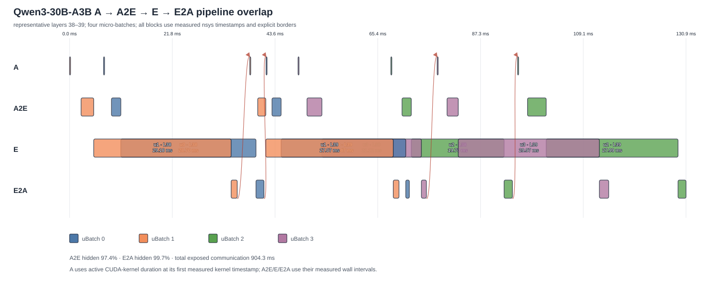
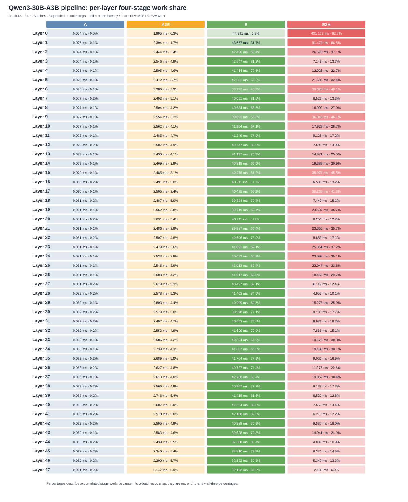

# Qwen3-30B-A3B 四阶段流水线实验

## 总结

本实验在 `four-stage-vllm-pipeline-dev-py` 分支上对比同步执行和四阶段
`A → A2E → E → E2A` 流水线。Frontend 使用 vLLM/GPU，Expert 使用本分支
Python Worker/CPU，传输为 gRPC。实验脚本固定本地模型和数据集，不会将
`Qwen/Qwen3-30B-A3B` 解释为需要从 Hugging Face 下载的仓库 ID。

2026-07-22 实测状态为 **FAIL（严格 token 等价未通过）**，不是环境阻塞：

| 模式 | Output tok/s | TPOT P50 | TPOT P95 | TTFT P50 |
|---|---:|---:|---:|---:|
| sync | 18.772 | 2095.674 ms | 2703.990 ms | 38586.633 ms |
| pipeline | 15.519 | 2801.291 ms | 3195.929 ms | 37373.999 ms |

流水线吞吐为同步的 `0.827x`（下降 17.3%）。两种模式各自 5 次运行均
bitwise deterministic，但模式间有 21/64 个请求、245/2048 个输出 token 不同；
首次分叉位于 request 9 的 token 21。详细原始报告在运行目录的
`results/qwen3-four-stage-report.md`。

一键命令：

```bash
cd /tmp/expert-kit-four-stage-vllm-pipeline-dev-py
/home/zhangyz/expert-kit/.venv/bin/python \
  ek-integration/expertkit_vllm/scripts/run_qwen3_experiment.py
```

该命令会幂等执行 `apply_vllm_pipeline_patch.py --apply`；已安装 v3 时只做
状态确认，原始或 v2 状态会升级，未知/部分修改的 vLLM 文件则拒绝覆盖。

默认输入为 ShareGPT52K 中确定性选出的 64 条 prompt，每条截断为 256 token，
固定生成 32 token；normal run 为 1 次 warmup + 5 次 measured run，NSys 另跑
1 次，不混入 TPOT。

输出目录：

```text
/home/zhangyz/expert-kit/output/qwen3-30b-a3b-pipeline-dev-py/
├── logs/                         # 每个模式的服务日志
├── nsys/                         # 原始 .nsys-rep 和导出的 SQLite
└── results/
    ├── sync.json                 # 正常 sync 原始结果
    ├── pipeline.json             # 正常 pipeline 原始结果
    ├── comparison.json           # 逐请求、逐 token 正确性与 speedup
    ├── nsys-analysis.json        # 全局和 48 层四阶段指标
    ├── qwen3-four-stage-report.md
    ├── qwen3-four-stage-report.json
    ├── qwen3-four-stage-share.svg
    └── qwen3-four-stage-overlap.svg
```

## 指标定义

- TPOT P50/P95：先对同一次 run 内每个请求计算
  `(last_token_ts - first_token_ts) / (output_tokens - 1)`，再取请求分位数；
  报告表中的值是多次 run 的中位数。
- Attention/A：decoder layer NVTX scope 内 CUDA kernel 时间区间的并集，包含
  Attention 以及此前约定归入 A 的 router、top-k/combine 等本地 GPU 工作。
- A2E：Frontend 开始 routed dispatch 到 Python Worker 首个 backend Expert
  compute 开始，包含序列化、gRPC、Host copy 和排队。
- Expert/E：Worker Torch backend Expert 计算的 wall interval。CPU Worker 的多个
  batch 是否并行由 `max_active_batches_per_device`、transport pending slot 和
  backend slot 共同约束，本配置均为 4 个 active slot，OMP/MKL 每个调用 4 线程。
- E2A：最后一个 Worker Expert compute 完成到 Frontend 得到 ready tensor，包含
  response 序列化、gRPC、H2D 和 weighted result readiness。

阶段 work time 会跨 micro-batch 重叠；阶段占比不是端到端 wall-time 占比。
报告同时给出 A2E/E2A 被其它 micro-batch A/E 覆盖的隐藏率。

## 实测瓶颈

| 模式 | A | A2E | E | E2A | 逻辑 Expert calls |
|---|---:|---:|---:|---:|---:|
| sync | 0.093 ms | 1.449 ms | 25.085 ms | 1.480 ms | 1488 |
| pipeline | 0.080 ms | 2.515 ms | 40.534 ms | 28.428 ms | 5808 |

以上是 decode 的每 call 均值；pipeline 的一个 scheduler step 被拆成约四个
micro-batch call，因此不能把单项均值直接当作端到端 wall time。通信合计隐藏率
为 99.5%，Worker admission queue 仅 0.016 ms/call。主要瓶颈是 CPU Expert：
更小的 token/expert GEMM 效率更低，同时四个 active call 争用 CPU 内存带宽和
线程资源，使单个小 call 的 E 反而从 25.085 ms 增至 40.534 ms；A2E 的编码、
调度开销也被重复四次。E2A P50 仅 1.787 ms，但异步 CUDA stream/协调器等待令
P95 达 59.174 ms，其中 99.7% 已被其它 uBatch 计算覆盖。





## 正确性

同步和流水线使用同一 ShareGPT sample manifest、同一 tokenizer token IDs、
temperature 0、同一 generation seed 和固定输出长度。`comparison.json` 只有在：

1. sync 的重复运行 bitwise deterministic；
2. pipeline 的重复运行 bitwise deterministic；
3. 两模式每个 request 的所有输出 token ID 完全一致；

三项全部满足时才标记 `PASS`。性能提升不能替代此检查。

## 分阶段运行

只测正常性能：

```bash
.../run_qwen3_experiment.py --skip-nsys
```

从已有 sync/pipeline 结果继续 NSys：

```bash
.../run_qwen3_experiment.py --resume
```

快速 smoke（仍加载完整 6144 experts）：

```bash
.../run_qwen3_experiment.py \
  --batch-sizes 4 --fixed-prompt-tokens 64 --output-tokens 2 \
  --warmup-runs 0 --runs 1 --skip-nsys
```

查看原始 NSys：把 `.nsys-rep` 复制到有桌面的机器，用与采集版本兼容的
Nsight Systems UI 打开；无 DISPLAY 的服务器不能直接运行 `nsys-ui`。也可在
服务器执行：

```bash
nsys stats --report nvtx_sum,cuda_gpu_kern_sum \
  /home/zhangyz/expert-kit/output/qwen3-30b-a3b-pipeline-dev-py/nsys/qwen3-pipeline-b64.nsys-rep
```

## 服务与缓存

脚本使用隔离端口 55432、6543、5001、5002、51061、51062，并检查冲突。启动
顺序为 PostgreSQL → Weight Server → Controller → Worker；只有 topology stream
确认 48 × 128 = 6144 条 ready routes 后才启动 vLLM。退出时仅停止本轮记录的
process group，保留数据库、权重缓存和报告供 `--resume` 使用。

首次 `weight build` 和 Worker 装载 57 GiB BF16 experts 会明显慢于后续运行。
若已经完成 weight index，可用 `--skip-weight-build`；这不会跳过 6144 route
ready 检查。

缓存均位于
`/home/zhangyz/expert-kit/output/qwen3-30b-a3b-pipeline-dev-py/`：Expert 权重
索引/切片在 `weight-cache/`，Worker 缓存在 `worker-cache/`，隔离 PostgreSQL
数据在 `postgres/`。模型直接读取 `/data/models/.../Qwen3-30B-A3B`，不会产生
Hugging Face 下载缓存。

## vLLM 动态 batch 修复

正式运行曾在最早 4 个请求结束、active batch 从 64 缩至 60 时触发
`block_table must have shape (batch_size, max_num_blocks_per_seq)`。根因是 vLLM
attention metadata cache 只按 KV spec/builder 类型索引，四个不等长 uBatch
（例如 14/14/14/15）会错误复用第一个 uBatch 的 `query_start_loc`。v3 补丁把
`ubatch id` 纳入 cache key，并新增补丁版本/哈希校验；修复后 warmup 加 5 次
正式运行覆盖多个不等长尾部 batch，均未再出现 shape 错误。
